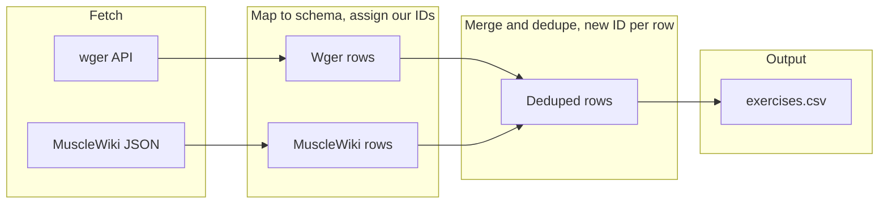

# Comprehensive Exercise CSV from wger, MuscleWiki, and ExRx

## Overview

Build a single comprehensive exercise CSV from **free** sources only: wger API and MuscleWiki unofficial export (and optionally ExRx later). ExerciseDB is **not** used because it is not free. Use a **temporary Python script** to fetch, map, merge, dedupe, and write CSV; **delete the script after the CSV is generated**. Array fields stored as JSON strings in cells. **Assign our own exerciseIds** (e.g. short alphanumeric like `K6NnTv0`); do not use source IDs. **No imageUrl or videoUrl** columns. This plan is written so the script can be implemented without guesswork and with clear error handling.

---

## Target schema (CSV columns)

One row per exercise. Columns:

| Column             | Type   | Notes                                                                                    |
| ------------------ | ------ | ---------------------------------------------------------------------------------------- |
| exerciseId         | string | **Our own ID** (e.g. short alphanumeric: `K6NnTv0`); generated per row, not from sources |
| name               | string | Exercise name                                                                            |
| equipments         | list   | JSON string in cell: `["Barbell"]`                                                       |
| bodyParts          | list   | e.g. `["Chest"]`                                                                         |
| exerciseType       | string | e.g. weight_reps, bodyweight, cardio                                                     |
| targetMuscles      | list   | Primary muscles                                                                          |
| secondaryMuscles   | list   | Secondary muscles                                                                        |
| keywords           | list   | JSON string; optional, can be derived from name + equipment                              |
| overview           | string | Short description                                                                        |
| instructions       | list   | JSON string: array of step strings                                                       |
| exerciseTips       | list   | JSON string; optional                                                                    |
| variations         | list   | JSON string; variation names or IDs                                                      |
| relatedExerciseIds | list   | JSON string; our own IDs for related exercises, optional                                 |
| source             | string | e.g. "wger", "musclewiki", "exrx" for attribution and dedupe                             |

**Removed:** imageUrl, videoUrl.

**CSV encoding for lists:** Store each list as a **JSON-encoded string** in the cell (e.g. `json.dumps(row["equipments"])`). Escape double-quotes in CSV per RFC 4180; use `csv.QUOTE_NONNUMERIC` when writing.

**Column order (for CSV header and rows):** exerciseId, name, equipments, bodyParts, exerciseType, targetMuscles, secondaryMuscles, keywords, overview, instructions, exerciseTips, variations, relatedExerciseIds, source.

**exerciseId generation:** When building each row (from wger, MuscleWiki, or merged), assign a new unique ID (e.g. 7-char alphanumeric: `''.join(random.choices(string.ascii_letters + string.digits, k=7))` or similar). For merged rows, one ID per final row. Do not use wger `uuid`, MuscleWiki `id`, or ExRx IDs in the CSV.

---

## Data sources (free only)

### 1. wger (primary, free API)

- **Endpoint:** `GET https://wger.de/api/v2/exerciseinfo/?language=2&limit=100&offset=...` (language=2 = English).
- **Pagination:** Loop with `offset=0`, `limit=100`; append each response `results` to a list; repeat until `next` in response is null. No API key required.
- **Response shape:** Each item in `results` has: `id`, `uuid`, `category` (object: `{id, name}`), `muscles` (array of `{id, name, name_en}`), `muscles_secondary` (same), `equipment` (array of `{id, name}`), `translations` (array of `{language, name, description}`). Do not use `id`/`uuid`; do not use image/video fields.
- **English content:** From `translations` pick the entry where `language == 2` (English). If none, skip that exercise or use first translation as fallback. Use that entry's `name` and `description`.
- **Mapping (exact paths):**
  - **bodyParts** ← `[item.get("category", {}).get("name")]` if isinstance(item.get("category"), dict) and item.get("category", {}).get("name") else `[]`.
  - **targetMuscles** ← `[m.get("name_en") or m.get("name") for m in item.get("muscles", [])]`.
  - **secondaryMuscles** ← `[m.get("name_en") or m.get("name") for m in item.get("muscles_secondary", [])]`.
  - **equipments** ← `[e.get("name") for e in item.get("equipment", [])]` (filter out None).
  - **name** ← from chosen translation's `name`; fallback `"Unknown"` if missing.
- **HTML → overview/instructions:** Strip tags from translation's `description` (e.g. `re.sub(r'<[^>]+>', ' ', html)` or `html.parser`); normalize whitespace (collapse newlines). **overview:** first paragraph (split on `\n\n`) or full stripped text if length &lt; 400; else truncate to 300 chars. **instructions:** split stripped text on `
` (before stripping) or on double newline; each chunk = one step; if only one chunk, store as `[single_string]`. Use standard library only (re, html.parser); no html2text required.
- **exerciseType:** If `category.name` or translation `name` contains "cardio" (case-insensitive) → `"cardio"`. Else if any equipment name contains "bodyweight" or "none (bodyweight" → `"bodyweight"`. Else → `"weight_reps"`.
- **Error handling:** Wrap each exercise mapping in try/except; on failure log and skip that exercise so one bad row does not stop the whole run.

### 2. MuscleWiki (unofficial, free)

- **Source:** Pre-exported from [LeManhDuy/MuscleWikiAPI](https://github.com/LeManhDuy/MuscleWikiAPI) (`workout-data.json` or API `https://workoutapi.vercel.app/exercises`). A sample is in project root: [musclewiki.md](musclewiki.md). The file is one long line (minified JSON); parse with `json.load(f)`.
- **Schema (from musclewiki.md):** Each item has: `Category`, `Difficulty`, `Force`, `Grips`, `details`, `exercise_name`, `id`, `steps`, `target`, `videoURL`, `youtubeURL`. We do not use `id`, `videoURL`, or `youtubeURL`.
- **Mapping to our CSV (use .get() to avoid KeyError):**
  - **name** ← `item.get("exercise_name") or "Unknown"`
  - **equipments** ← `[item.get("Category")]` if item.get("Category") else `[]` (Category is equipment: "Barbell", "Dumbbells", etc.)
  - **target** ← `item.get("target") or {}`; **targetMuscles** ← `target.get("Primary", [])`; **secondaryMuscles** ← `target.get("Secondary", [])`
  - **bodyParts** ← same as targetMuscles for simplicity (or map Primary to body region later)
  - **exerciseType** ← `"bodyweight"` if (item.get("Category") or "").lower().find("bodyweight") >= 0 else `"weight_reps"`
  - **overview** ← from `item.get("details") or ""`: split on `**Ty's Tips**`; take first part; strip markdown/newlines; if longer than 300 chars truncate to 300. If no "Ty's Tips", use full details (truncated).
  - **instructions** ← `item.get("steps") or []` (already array of strings)
  - **exerciseTips** ← from details: if "**Ty's Tips**" in details, take text after it; split into list of sentences or one string in a list; else `[]`
  - **keywords** ← `[]` or `[name, item.get("Category")]` filtered; **variations** ← `[]`; **relatedExerciseIds** ← `[]`
  - **source** ← `"musclewiki"`
- **Script input:** If [musclewiki.md](musclewiki.md) exists in project root, open and `json.load`; else `requests.get("https://workoutapi.vercel.app/exercises")` and parse JSON. Prefer local file to avoid network and rate limits.
- **Error handling:** If an item is missing `exercise_name`, skip it or use "Unknown". If `target` is missing or not a dict, use targetMuscles=`[]`, secondaryMuscles=`[]`. Wrap each item in try/except so one bad item does not stop the run.

### 3. ExRx.net (optional; omitted in Phase 1)

- ExRx.net does **not** offer a free API; they sell access (Economy/Premium). Scraping their site has ToS/legal risk. **Phase 1 = wger + MuscleWiki only.** If you later obtain ExRx data (e.g. your own crawl for personal use or a community export), add a third source: map to same schema, assign our own exerciseIds, no imageUrl/videoUrl.

---

## Merge and deduplication

- **Dedupe key:** Single function `normalize_key(row)` returning e.g. `" ".join((row.get("name") or "").lower().strip().split())`. Optionally refine to `normalized_name + "|" + "|".join(sorted(row.get("equipments") or []))` so "Bench Press" (Barbell) and "Bench Press" (Dumbbell) stay separate; document in a comment that name-only may over-merge. Build a dict: key → list of rows; for each key with multiple rows, merge into one.
- **Merge logic when combining two rows:** For list fields (equipments, bodyParts, targetMuscles, secondaryMuscles, keywords): concatenate lists, then dedupe and sort: `sorted(set(list_a + list_b))`. For overview and instructions: take first non-empty; if both empty keep "". Set source = `"wger,musclewiki"`. For merged row assign **one** new exerciseId (do not keep either source ID).
- **exerciseId:** One new **our-own** ID per final row (including merged rows). Generate e.g. 7-char alphanumeric: `''.join(random.choices(string.ascii_letters + string.digits, k=7))`. Ensure uniqueness: keep a set of used IDs; if collision (very unlikely at ~2k rows), regenerate. Do not use wger uuid, MuscleWiki id, or ExRx IDs.
- **relatedExerciseIds:** Leave as `[]` for v1. Optional later: build name→ourId lookup; for wger exercises with variations, resolve variation names to our IDs and fill this column.

---

## Implementation

1. **Script location and paths:** Create `scripts/build_exercise_csv.py`. Assume run from **project root** (user must `cd` to repo root). Paths: `musclewiki_path = "musclewiki.md"`, `output_path = "data/exercises.csv"`. Alternatively derive project root from script: `PROJECT_ROOT = os.path.dirname(os.path.dirname(os.path.abspath(__file__)))` and join paths; then script can be run from anywhere.
2. **Dependencies:** Use `requests` (already in Alfred's requirements) for wger and MuscleWiki API fallback. Standard library only for HTML: `re`, `html.parser`; for data: `json`, `csv`, `random`, `string`. No new dependencies.
3. **Temporary script steps:**
  - Fetch wger: paginate exerciseinfo (language=2), map each item to one row (see wger mapping), assign new exerciseId per row; on per-row exception log and skip.
  - Load MuscleWiki: if [musclewiki.md](musclewiki.md) exists in project root, open and `json.load`; else GET `https://workoutapi.vercel.app/exercises` and parse JSON. Map each item to one row (see MuscleWiki mapping), assign new exerciseId; on per-row exception log and skip.
  - Merge: build dict by `normalize_key(row)`; for keys with multiple rows, merge (combine lists with dedupe, first non-empty overview/instructions); assign one new exerciseId per merged row.
  - Write CSV: column order = exerciseId, name, equipments, bodyParts, exerciseType, targetMuscles, secondaryMuscles, keywords, overview, instructions, exerciseTips, variations, relatedExerciseIds, source. For list columns write `json.dumps(value)` so each cell is a JSON string. Use `csv.writer` with `quoting=csv.QUOTE_NONNUMERIC` so cells with commas/quotes are quoted correctly. For missing/optional fields use `[]` or `""` (never leave None that could serialize as "None").
4. **Empty values:** Optional fields (keywords, exerciseTips, variations, relatedExerciseIds) default to `[]`; overview/instructions can be `""` or `"[]"` as appropriate. In CSV, empty list → `"[]"`, empty string → `""`.
5. **Output:** Write to `data/exercises.csv`. Ensure `data/` exists (script can `os.makedirs("data", exist_ok=True)`). Optionally add `data/exercises.csv` to `.gitignore` if you do not want to commit the CSV.
6. **Delete script later:** Treat the script as one-off; remove `scripts/build_exercise_csv.py` after the CSV is generated and you are satisfied with the data.

---

## Flow (high level)

---

## Summary of decisions (quick reference)

- **Temporary script:** One-off script; delete after CSV is built.
- **No imageUrl / videoUrl:** Omitted from schema and all mappings.
- **exerciseId:** We assign our own unique IDs (e.g. 7-char alphanumeric); never use wger/MuscleWiki/ExRx IDs.
- **Free only:** wger + MuscleWiki. ExerciseDB excluded (not free). ExRx omitted in Phase 1 (no free API; scraping has ToS risk).
- **Robustness:** Per-row try/except for wger and MuscleWiki; use .get() for optional keys; merge list fields with dedupe (sorted(set(a+b))); ensure exerciseId uniqueness; CSV QUOTE_NONNUMERIC; optional fields default to [] or "".
- **Input:** wger via API (paginated); MuscleWiki from [musclewiki.md](musclewiki.md) in project root if present, else API. Run script from project root.

---

## Edge cases and robustness

- **wger:** Missing English translation (language=2): skip exercise or use first available translation. Missing category/muscles/equipment: use `[]` or `""`. Malformed HTML in description: strip tags and proceed; if strip fails, use "" for overview/instructions.
- **MuscleWiki:** Missing `exercise_name`: use "Unknown" or skip. Missing `target`: use `{}`; then targetMuscles=`[]`, secondaryMuscles=`[]`. Missing `steps`: use `[]`. `details` without "Ty's Tips": use full details (truncated) for overview, exerciseTips=`[]`.
- **Merge:** When combining list fields, use `sorted(set(a + b))` so no duplicate values (e.g. ["Chest","Chest"] → ["Chest"]).
- **IDs:** Keep a set of used exerciseIds; if generated ID already exists, regenerate until unique.
- **CSV:** Escape double-quotes inside JSON strings (json.dumps does this). Use QUOTE_NONNUMERIC so entire cell is quoted when it contains comma or newline.

---

## What you need to do (checklist)

**Before running the script**

1. **Python env:** Use the same env as Alfred; ensure `requests` is available (`pip install requests` if needed).
2. **MuscleWiki data:** Keep [musclewiki.md](musclewiki.md) in project root (you already added the sample). The script will read it as JSON; if the file is missing, it will try `https://workoutapi.vercel.app/exercises`.
3. **Run from project root:** `cd` to the Alfred repo root so paths `musclewiki.md` and `data/exercises.csv` resolve (or script derives project root from `__file__`).
4. **Output dir:** Script can create `data/` with `os.makedirs("data", exist_ok=True)`; optionally add `data/exercises.csv` to `.gitignore` if you do not want to commit the CSV.

**When running**

1. **Network:** wger API needs internet. MuscleWiki can be read from musclewiki.md (no network if file present).
2. **First run:** Run the script. If you see KeyError or empty CSV, check: (a) wger response has `results`, each item has `translations` and `category`; (b) musclewiki.md is valid JSON and items have `exercise_name`, `target`, `steps`.
3. **Inspect CSV:** Open `data/exercises.csv` in a spreadsheet or run `head`; spot-check name, instructions, equipments, source columns.

**After**

1. **Delete script:** Remove `scripts/build_exercise_csv.py` once you are satisfied with the CSV.
2. **Wire Alfred (optional):** Use the CSV or a derived `gym_workouts.json` for the app (e.g. for [nlp/database_loader.py](nlp/database_loader.py)); separate step if desired.

---

